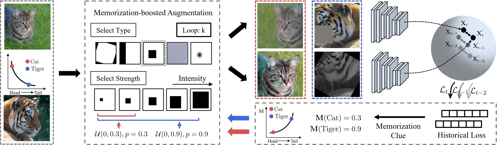

# Contrastive Learning with Boosted Memorization

**Keywords**: Long-Tailed Recognition, Self-Supervised Learning, Memorization Effect

**[Contrastive Learning with Boosted Memorization](https://arxiv.org/abs/2205.12693)**  

ICML 2022

```
@inproceedings{
    zhou2022boosted,
    title={Contrastive Learning with Boosted Memorization},
    author={Zhou, Zhihan and Yao, Jiangchao and Wang, Yanfeng and Han, Bo and Zhang, Ya},
    booktitle={International Conference on Machine Learning},
    year={2022},
    organization={PMLR}
}
```


<div align="left">
  
</div>

**Abstract**: Self-supervised learning has achieved a great success in the representation learning of visual and textual data. However, the current methods are mainly validated on the well-curated datasets, which do not exhibit the real-world long-tailed distribution. Recent attempts to consider self-supervised long-tailed learning are made by rebalancing in the loss perspective or the model perspective, resembling the paradigms in the supervised long-tailed learning. Nevertheless, without the aid of labels, these explorations have not shown the expected significant promise due to the limitation in tail sample discovery or the heuristic structure design. Different from previous works, we explore this direction from an alternative perspective, i.e., the data perspective, and propose a novel Boosted Contrastive Learning (BCL) method. Specifically, BCL leverages the memorization effect of deep neural networks to automatically drive the information discrepancy of the sample views in contrastive learning, which is more efficient to enhance the long-tailed learning in the label-unaware context. Extensive experiments on a range of benchmark datasets demonstrate the effectiveness of BCL over several state-of-the-art methods.

## Get Started

### Environment
- Python (3.7.10)
- Pytorch (1.7.1)
- torchvision (0.8.2)
- CUDA
- Numpy

### File Structure

After the preparation work, the whole project should has the following structure:

```
./Boosted-Contrastive-Learning
├── README.md
├── data                            # datasets and augmentations
│   ├── memoboosted_cifar100.py
│   ├── cifar100.py                   
│   ├── augmentations.py
│   └── randaug.py
├── models                          # models and backbones
│   ├── simclr.py
│   ├── sdclr.py
│   ├── resnet.py
│   ├── resnet_prune_multibn.py
│   └── utils.py
├── losses                          # losses
│   └── nt_xent.py   
├── split                           # data split
│   ├── cifar100                        
│   └── cifar100_imbSub_with_subsets
├── eval_cifar.py                   # linear probing evaluation code
├── test.py                         # testing code
├── train.py                        # training code
├── train_sdclr.py                  # training code for sdclr
└── utils.py                        # utils
```

## Quick Preview
A code snippet of the BCL is shown below. 

```python

train_datasets = memoboosted_CIFAR100(train_idx_list, args, root=args.data_folder, train=True)

# initialize momentum loss
shadow = torch.zeros(dataset_total_num).cuda()
momentum_loss = torch.zeros(args.epochs,dataset_total_num).cuda()

shadow, momentum_loss = train(train_loader, model, optimizer, scheduler, epoch, log, shadow, momentum_loss, args=args)
train_datasets.update_momentum_weight(momentum_loss, epoch)

```

During the training phase, track the momentum loss. 

```python

if epoch>1:
    new_average = (1.0 - args.momentum_loss_beta) * loss[batch_idx].clone().detach() + args.momentum_loss_beta * shadow[index[batch_idx]]
else:
    new_average = loss[batch_idx].clone().detach()
    
shadow[index[batch_idx]] = new_average
momentum_loss[epoch-1,index[batch_idx]] = new_average

```

### Training

To train model on CIFAR-100-LT, simply run:

- SimCLR
```train SimCLR
python train.py SimCLR --lr 0.5 --epochs 2000 --temperature 0.2 --weight_decay 5e-4 --data_folder ${data_folder} --trainSplit cifar100_imbSub_with_subsets/cifar100_split1_D_i.npy 
```

- BCL-I
```train BCL-I
python train.py BCL_I --bcl --lr 0.5 --epochs 2000 --temperature 0.2 --weight_decay 5e-4 --data_folder ${data_folder} --trainSplit cifar100_imbSub_with_subsets/cifar100_split1_D_i.npy 
```

- SDCLR
```train SimCLR
python train_sdclr.py SDCLR --lr 0.5 --epochs 2000 --temperature 0.2 --weight_decay 1e-4 --data_folder ${data_folder} --trainSplit cifar100_imbSub_with_subsets/cifar100_split1_D_i.npy 
```

- BCL-D
```train BCL-D
python train_sdclr.py BCL_D --bcl --lr 0.5 --epochs 2000 --temperature 0.2 --weight_decay 1e-4 --data_folder ${data_folder} --trainSplit cifar100_imbSub_with_subsets/cifar100_split1_D_i.npy 
```

Pretrained checkpoints will be saved in 'checkpoints/'.

### Evaluating

To evalutate the pretrained model, simply run:

- SimCLR, BCL-I
```test SimCLR, BCL-I
python test.py --checkpoint ${checkpoint_pretrain} --test_fullshot --test_100shot --test_50shot --data_folder ${data_folder}
```

- SDCLR, BCL-D
```test SDCLR, BCL-D
python test.py --checkpoint ${checkpoint_pretrain} --prune --test_fullshot --test_100shot --test_50shot --data_folder ${data_folder}
```

The code will output the results of full-shot/100-shot/50-shot linear probing evaluation.

### Extensions

**Steps to Implement Your Own Model**

- Add your model to ./models and load the model in train.py.
- Implement functions(./losses) specfic to your models in train.py.

**Steps to Implement Other Datasets**

- Create long-tailed splits of the datasets and add to ./split.
- Implement the dataset (e.g. memoboosted_cifar100.py).

## Acknowledgement

We borrow some codes from [SDCLR](https://github.com/VITA-Group/SDCLR), [RandAugment](https://github.com/ildoonet/pytorch-randaugment) and [W-MSE](https://github.com/htdt/self-supervised).
